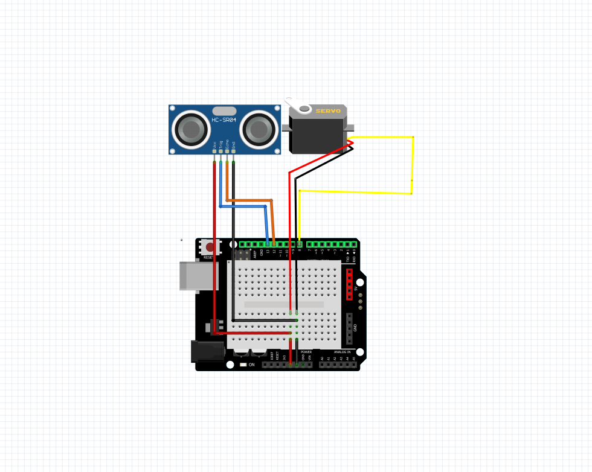

# NotSoBasicArduino

New ping and Hello functions are 2 seprate assigments. New ping was to learn how to use the ping library. Hello functions was to learn how to use the sensor as well as using functions to replace code.

reflection (what was hard & what did you learn by overcoming that, OR what tips would you want to pass down to the next person doing this?)

test test
