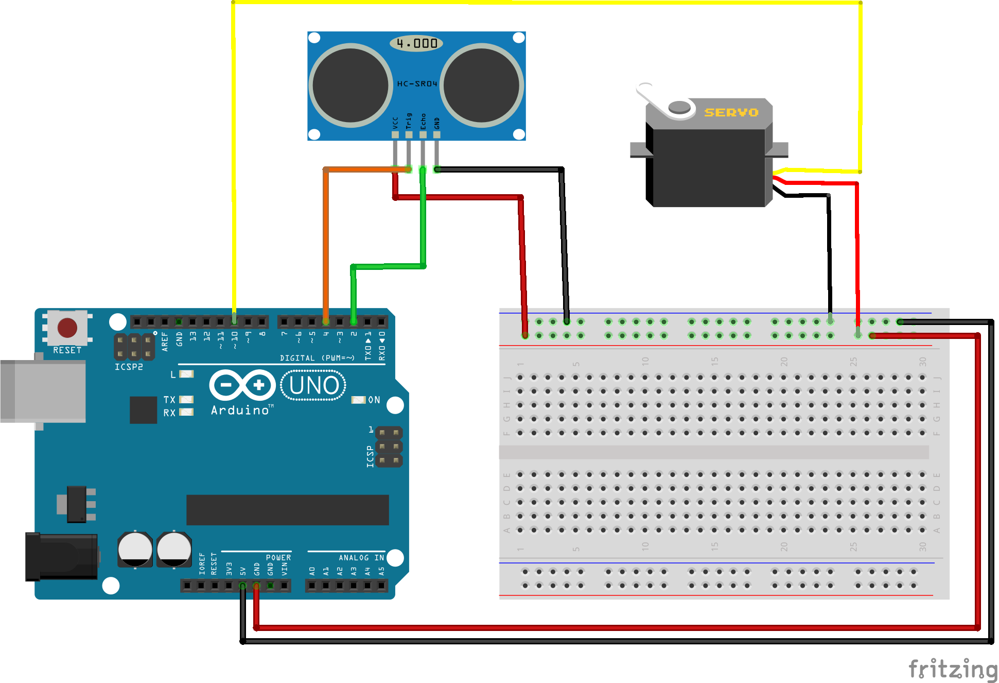

# NotSoBasicArduino

## Hello functions

### Description
Hello Functions is an assignment that uses functions to make a servo turn with a ultrasonic sensor.

### What I Learned 
-I learend how to apply functions to code.
-I learned that Arduino has bits of code are very helpful. 

## Wiring Diagram 

## New Ping 

### Description 
New ping is an assignment that uses the NewPing libarary to recive time value when a button is pressed. 

### What I Learned 
- I Learned how to use NewPing library
- I learned how to set up a ultrasonic sensor 

## Wiring Diagram 

